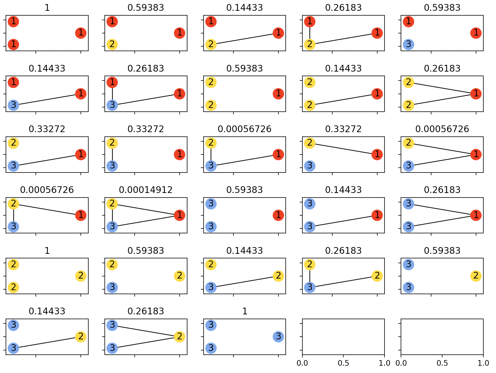

# Labeled Flag Algebra Solver for Multipartite Turan Problem

## Overview
This set of scripts accompanies my senior honors thesis on the Multipartite Turan Problem, introduced by Nagy et. al. These scripts implement the flag algebra framework introduced by Razborov, applied to clustered graphs (i.e. graphs whose vertices have labels in [n]). Flag algebras allow us to represent graph optimization problems as numerical semidefinite programs, which we attempt to do here.

In the current state, we can run the SDP attempting to minimize the density of independent sets of size 3 (with one vertex in each cluster), given the edge density between any two clusters (denoted as rho). We wish to find the mininum rho such that the density of independent sets is strictly positive. To do so, we can run the following, which yields a graph of the rhos against their corresponding objective values:
```
python triangle_solver.py
```
However, the current SDP yields an optimal edge density of 1/3, whereas the known optimal edge density is 2 - phi, which is around 0.382. Therefore, more conditions need to be applied to the SDP. With verbosity on in `triangle_solver.py`, we can see the "solution" that the SDP outputs. 

However, we can verify that this assignment of flag densities is not valid i.e. no configuration of three clusters can realize these densities.


## Python Requirements
* cvxopt
* Irene
* networkx

## Todo List:
* Flag Algebras
    * Average a flag graph for types of size > 1
    * Write a test suite (similar to a Django test suite, toggle for 
    testing visual cases)
* Semidefinite program
    * Write K4 flag setup
